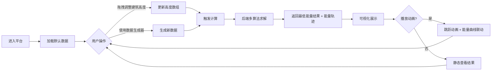

## 1. 产品概述

机器人跳跃算法数据分析平台——一个面向算法学习者和工程师的交互式分析工具，用于可视化研究经典"机器人跳跃找最低初始能量"算法问题。用户可以直观调整建筑高度数组，系统实时对比多种算法求解，并展示跳跃过程中能量的动态变化。

- 核心价值：将抽象算法问题转化为可交互、可视化的分析平台，帮助用户理解二分查找、模拟退火、动态规划等算法的性能差异与工作原理
- 目标用户：算法学习者、计算机科学学生、工程师、算法竞赛爱好者

## 2. 核心功能

### 2.1 用户角色

| 角色 | 注册方式 | 核心权限 |
|------|---------|---------|
| 访客用户 | 无需注册 | 使用所有分析功能、调整参数、导出结果 |

### 2.2 功能模块

1. **主面板（首页）**：建筑可视化区、拖拽控制器、算法选择器、结果展示卡
2. **算法分析区**：多种算法对比、执行时间、计算结果差异
3. **能量动态图**：折线图展示跳跃过程中的能量变化、最低能量点标记
4. **数据生成器**：随机生成建筑高度数组、参数化控制（建筑数量、高度范围、分布模式）

### 2.3 页面详情

| 页面名称 | 模块名称 | 功能描述 |
|---------|---------|------------|
| 主面板 | 建筑可视化区 | 柱状图展示各建筑高度，机器人图标在建筑间跳跃动画 |
| 主面板 | 拖拽控制器 | 支持拖拽调整每个柱子高度，实时更新数值 |
| 主面板 | 算法选择器 | 切换/多选算法：二分查找、模拟退火、动态规划、贪心、暴力枚举 |
| 主面板 | 结果展示卡 | 显示各算法计算的最低初始能量、执行耗时、迭代次数 |
| 能量动态图 | 折线图区 | 展示从0号到末号建筑每次跳跃后的能量变化曲线 |
| 能量动态图 | 动画控制 | 播放/暂停跳跃动画，高亮当前建筑与对应能量点 |
| 数据生成器 | 参数面板 | 设置建筑数量、最小/最大高度、分布类型（随机/递增/递减/山峰） |
| 数据生成器 | 操作按钮 | 一键生成、重置示例、复制数据、导出JSON |

## 3. 核心流程

用户进入平台后，系统默认加载一组示例建筑数据。用户可以：
1. 直接在建筑图上拖拽柱子调整高度，或使用数据生成器创建新数据
2. 选择一个或多个对比算法
3. 系统实时计算并更新最低初始能量结果
4. 点击播放按钮，观看机器人跳跃动画与能量变化曲线
5. 对比不同算法的执行效率与结果差异

## 4. 用户界面设计

### 4.1 设计风格

**设计主题：赛博朋克数据实验室**
- 主色调：深邃藏青 `#0f172a` + 霓虹青 `#22d3ee` + 电光紫 `#a78bfa`
- 辅助色：琥珀黄 `#fbbf24` 用于高亮能量危险区，翠绿 `#34d399` 用于安全区
- 背景：深色渐变 + 网格纹理 + 轻微噪点叠加，营造科技实验室氛围
- 按钮风格：微玻璃拟态（半透明 + 毛玻璃 + 细边框发光），圆角 10px
- 字体：标题使用 Space Grotesk（几何现代感），正文使用 JetBrains Mono（等宽代码字体）
- 图标风格：线性几何风，搭配霓虹光晕

### 4.2 页面设计概览

| 页面名称 | 模块名称 | UI元素 |
|---------|---------|--------|
| 主面板 | 顶部标题区 | 渐变文字Logo、副标题说明、主题切换、信息图标 |
| 主面板 | 建筑可视化区 | 霓虹边框的3D柱子（高度=建筑高度）、顶部高度数字标签、可拖拽把手、起始/结束标记 |
| 主面板 | 算法选择器 | 横向卡片式多选，选中状态带发光边框，显示算法小图标 |
| 主面板 | 结果对比表 | 表格展示：算法名 / 最低能量 / 执行时间 / 迭代次数 / 状态徽章 |
| 能量动态图 | 折线图 | 渐变填充区域、多色能量线（安全区绿色/危险区红色）、关键节点带标记、坐标网格 |
| 能量动态图 | 播放控制 | 进度条、播放/暂停按钮、速度调节（0.5x / 1x / 2x）、跳跃步进按钮 |
| 数据生成器 | 参数卡 | 滑动条输入、数字输入框、分布类型单选胶囊 |
| 数据生成器 | 操作区 | 主按钮（生成）、次按钮（重置/复制/导出），按钮带悬浮上浮效果 |

### 4.3 响应式设计

- 桌面端（≥1200px）：三栏布局（左：建筑区，中：能量图，右：控制面板）
- 平板端（768-1199px）：上下布局，建筑区与能量图各占50%高度，控制面板置底
- 移动端（<768px）：垂直堆叠，触控友好的大尺寸拖拽区域，按钮最小高度 48px

### 4.4 动效设计

- 页面加载：各模块从底部上浮渐入，stagger 延迟 100ms
- 建筑拖拽：柱子高度实时变化，数字标签浮动跟随
- 能量计算：结果数字滚动动画（从旧值过渡到新值）
- 机器人跳跃：弧形抛物线轨迹 + 压缩/拉伸形变 + 落地粒子效果
- 能量折线：路径描边动画（逐段绘制）+ 节点脉冲光晕
