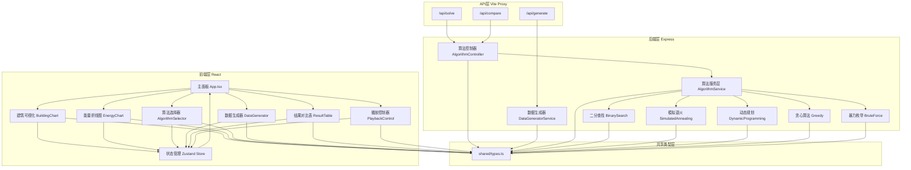
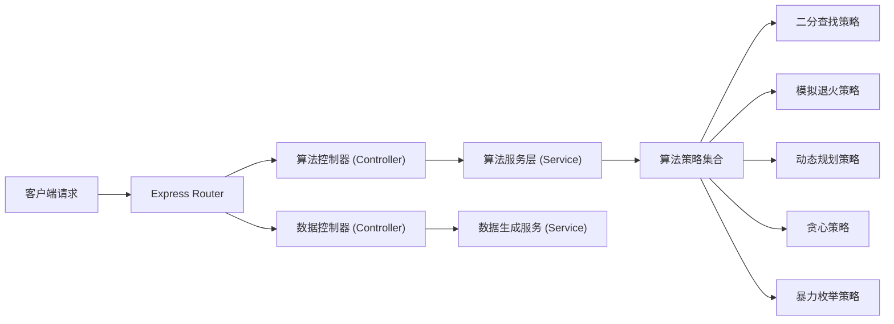

## 1. 架构设计



## 2. 技术说明

- **前端**：React 18 + TypeScript + Tailwind CSS 3 + Vite
- **状态管理**：Zustand（轻量级，存储建筑数组、算法选择、计算结果、播放状态）
- **图表可视化**：自定义 SVG 组件（建筑图）+ Recharts（能量折线图）
- **拖拽交互**：原生 Pointer Events API 实现建筑高度拖拽
- **后端**：Express 4 + TypeScript（ESM 模块）
- **初始化工具**：使用 `react-express-ts` 模板脚手架
- **动画**：Framer Motion（页面过渡、机器人跳跃、数字滚动）
- **图标库**：lucide-react

## 3. 路由定义

| 路由 | 用途 |
|------|------|
| / | 主面板（单页应用，所有功能模块整合） |

### API 路由

| 路由 | 方法 | 用途 |
|------|------|------|
| /api/solve | POST | 使用指定算法计算最低初始能量，返回能量轨迹 |
| /api/compare | POST | 同时使用多种算法求解，返回对比结果 |
| /api/generate | POST | 根据参数随机生成建筑高度数组 |

## 4. API 定义

### 4.1 类型定义

```typescript
// shared/types.ts
export interface BuildingData {
  heights: number[];
}

export type AlgorithmType = 
  | 'binary_search' 
  | 'simulated_annealing' 
  | 'dynamic_programming' 
  | 'greedy' 
  | 'brute_force';

export interface SolveRequest {
  heights: number[];
  algorithm: AlgorithmType;
}

export interface SolveResponse {
  algorithm: AlgorithmType;
  minInitialEnergy: number;
  energyTrace: number[];
  executionTimeMs: number;
  iterations: number;
  success: boolean;
}

export interface CompareRequest {
  heights: number[];
  algorithms: AlgorithmType[];
}

export interface CompareResponse {
  results: SolveResponse[];
}

export type DistributionType = 'random' | 'increasing' | 'decreasing' | 'peak';

export interface GenerateRequest {
  count: number;           // 建筑数量，默认 10
  minHeight: number;       // 最小高度，默认 1
  maxHeight: number;       // 最大高度，默认 100
  distribution: DistributionType;
  seed?: number;           // 可选随机种子
}

export interface GenerateResponse {
  heights: number[];
  seed: number;
}
```

### 4.2 请求响应示例

**POST /api/solve**
```json
// Request
{
  "heights": [3, 1, 4, 6, 2, 5],
  "algorithm": "binary_search"
}

// Response
{
  "algorithm": "binary_search",
  "minInitialEnergy": 4,
  "energyTrace": [4, 6, 5, 7, 5, 3, 6],
  "executionTimeMs": 0.12,
  "iterations": 17,
  "success": true
}
```

## 5. 服务器架构图



## 6. 数据模型

本项目为无持久化数据的纯计算服务，所有数据为内存对象。

### 6.1 算法问题说明

**能量变化规则**（经典变体，复杂度更高）：
- 机器人在建筑 i 时拥有能量 E_i
- 跳跃到建筑 i+1 时：
  - 若 H[i+1] > H[i]（向上跳）：E_{i+1} = E_i - 2 × (H[i+1] - H[i])
  - 若 H[i+1] < H[i]（向下跳）：E_{i+1} = E_i + (H[i] - H[i+1])
  - 若 H[i+1] = H[i]：E_{i+1} = E_i
- 约束：所有时刻能量 E_i ≥ 0，否则失败
- 目标：找到最小的初始能量 E_0 使机器人能从建筑 0 跳到建筑 n-1

### 6.2 算法实现说明

| 算法 | 时间复杂度 | 思路概要 |
|------|-----------|---------|
| 二分查找 | O(n log(maxHeight)) | 对初始能量二分，每次 O(n) 验证可行性 |
| 贪心 | O(n) | 从终点倒推所需最小能量 |
| 动态规划 | O(n) | 从终点递推 dp[i] = 到达 i 后最少需保留能量 |
| 模拟退火 | O(k × n) | 随机搜索近似解，k 为迭代降温次数 |
| 暴力枚举 | O(n × maxHeight) | 从 0 递增尝试每个初始能量，直到可行 |

### 6.3 项目目录结构

```
e:\trae3\a44\
├── api/                          # Express 后端
│   ├── src/
│   │   ├── controllers/
│   │   │   ├── AlgorithmController.ts
│   │   │   └── DataController.ts
│   │   ├── services/
│   │   │   ├── AlgorithmService.ts
│   │   │   ├── DataGeneratorService.ts
│   │   │   └── algorithms/
│   │   │       ├── BinarySearch.ts
│   │   │       ├── SimulatedAnnealing.ts
│   │   │       ├── DynamicProgramming.ts
│   │   │       ├── Greedy.ts
│   │   │       └── BruteForce.ts
│   │   ├── types/
│   │   │   └── index.ts
│   │   ├── utils/
│   │   │   └── energySimulator.ts
│   │   └── index.ts
│   └── tsconfig.json
├── shared/
│   └── types.ts                  # 前后端共享类型
├── src/                          # React 前端
│   ├── components/
│   │   ├── BuildingChart/        # 建筑柱状图（可拖拽）
│   │   ├── EnergyChart/          # 能量折线图
│   │   ├── AlgorithmSelector/    # 算法选择器
│   │   ├── DataGenerator/        # 数据生成面板
│   │   ├── ResultTable/          # 结果对比表
│   │   └── PlaybackControl/      # 动画播放控制
│   ├── store/
│   │   └── useAppStore.ts        # Zustand 状态
│   ├── hooks/
│   │   ├── useDragResize.ts      # 拖拽调整高度
│   │   └── useSolver.ts          # 调用后端求解
│   ├── utils/
│   │   └── formatters.ts
│   ├── App.tsx
│   ├── main.tsx
│   └── index.css
├── package.json
├── vite.config.ts
├── tailwind.config.js
└── tsconfig.json
```
